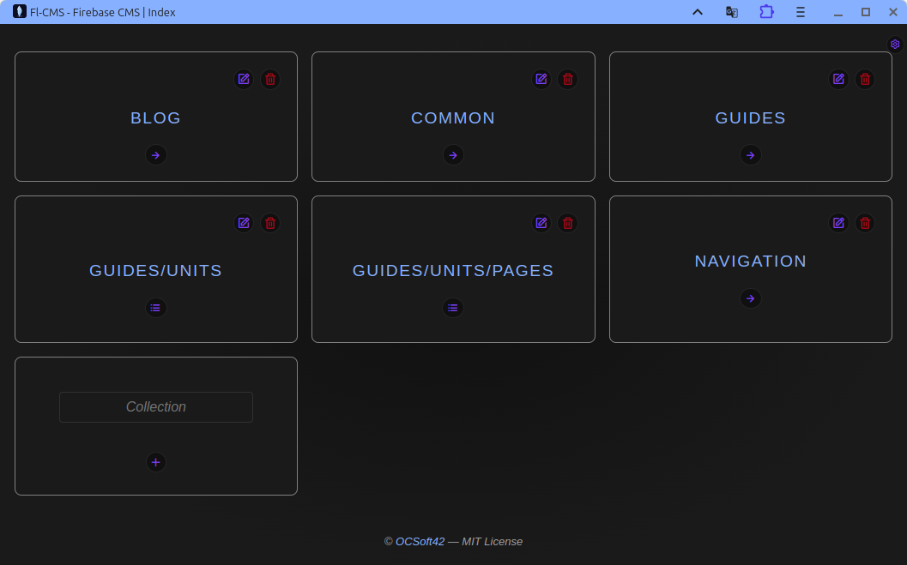
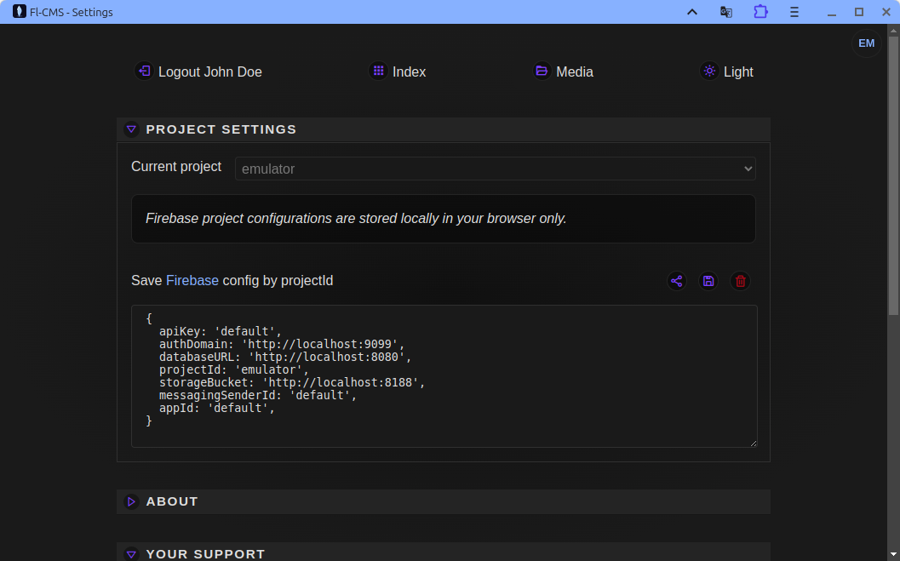
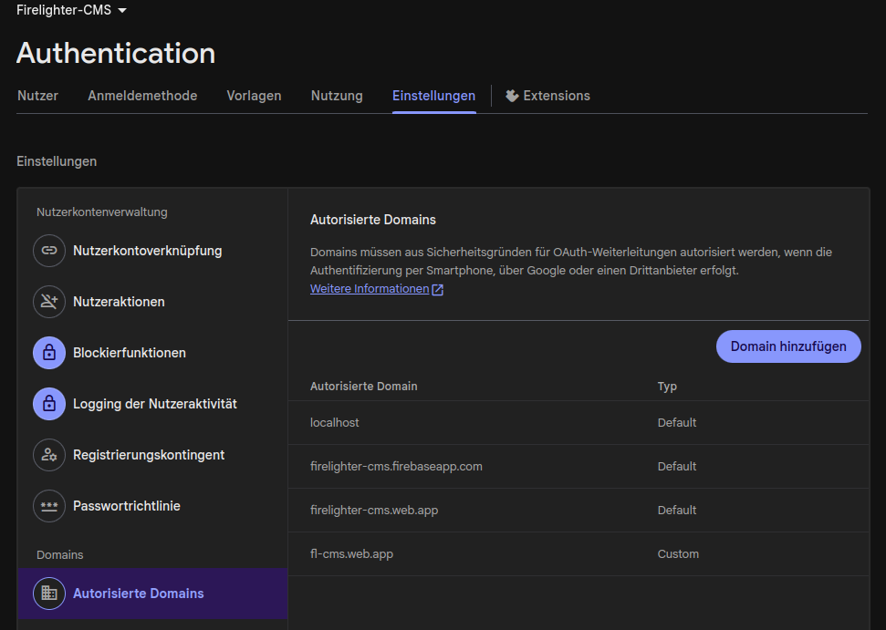

<a name="readme-top"></a>

# 🔥 Fl-CMS (aka Firelighter CMS) 🔥

A minimal and lean browser-based headless CMS for [Firebase](https://firebase.google.com/) simular to [FireCMS](https://app.firecms.co) Firestore --- built
with Svelte 4 and delivered as a PWA.

**Live Demo:** 
- Prod: [fl-cms.web.app](https://fl-cms.web.app)
- Beta: [firelighter-cms.web.app](https://firelighter-cms.web.app)

## Why Fl-CMS?

I wanted a Firestore CMS that is:

-   **simple**
-   **fast**
-   **React-free**
-   **and works directly in the browser without any backend layer**

Existing tools like [FireCMS](https://app.firecms.co) or [Flamelink](https://flamelink.io) are powerful, but I wasn't happy with the UX
and the complexity for smaller projects. I also preferred a non-React
stack and wanted better handling for sub-collections and simpler content
editing as well a simple access to images on the firebase storage.

Fl-CMS tries to solve this by focusing on:

-   minimalism
-   intuitive editing
-   full PWA support

<p align="right">(<a href="#readme-top">back to top</a>)</p>

## Features

First of all the UI is much simpler. You can create subcollections just like 
`foo/bar/baz` which will create a collection `foo` with a subcollection `bar` with another nested subcollection `baz`.

-   ⚡ **Runs fully in the browser** --- no server required
-   📄 **Headless CMS for Firestore** (reads/writes your data directly)
-   🔧 **Uses the same property model format as FireCMS**
-   🔍 **Automatically generates property definitions from existing documents**
-   🖥️ **Clean UI with simple support for nested sub-collections**
-   ✏️ **Simple, uncluttered content editing simular to WordPress**
-   💾 **Backup or migrate your data from JSON**
-   🏝️ **Integrated [storage management](./docs/images/fl-cms_media.png) for your images**
-   📁 **Metadata stored directly in your Firestore** (`__schema`)
-   📱 **PWA support** --- can be installed on desktop/mobile
-   🛠️ **Built with Svelte 4 (SPA)**


<p align="right">(<a href="#readme-top">back to top</a>)</p>

## Screenshot / Preview




<p align="right">(<a href="#readme-top">back to top</a>)</p>

## Quick Start

``` bash
git clone https://github.com/ortwic/web-apps.git
cd web-apps/apps/fl-cms
npm install
npm run dev
```

Then open the app in your browser:
http://localhost:5000

### Firebase Setup

Add your connection info in the settings page. They'll be stored in local storage of your browser only!

``` js
const firebaseConfig = {
    apiKey: 'AIzaSy...DGo4k',
    authDomain: 'myapp-project-123.firebaseapp.com',
    databaseURL: 'https://myapp-project-123.firebaseio.com',
    projectId: 'myapp-project-123',
    storageBucket: 'myapp-project-123.appspot.com',
    messagingSenderId: '123456789',
    appId: '1:123456789:web:ec2e...94d0',
    measurementId: 'G-12345'
};
```




### Authentication Setup

Authentication is the same as used by your project. So make sure your user has sufficient permissions to read and write contents in firestore.

Currently Google is supported only. (Contribute others if you like)

<span style="font-size: large;text-transform: uppercase;
    letter-spacing: .15rem;">**Important Detail**</span>

If you like to use the app online via [fl-cms.web.app](https://fl-cms.web.app) or [firelighter-cms.web.app](https://firelighter-cms.web.app), 
you have to allow those domains for authentication!



Otherwise you must host the instance yourself. 
See the official [firebase documentation](https://firebase.google.com/docs/hosting).

<p align="right">(<a href="#readme-top">back to top</a>)</p>

## Usage

### 1. Connect your Firebase project

Sign in and select the Firestore project you want to manage.

### 2. Auto-generated schema

Property definitions are generated automatically and stored in:

    __schema / <collection>

### 3. Edit content

Work with [collections](./docs/images/fl-cms_list.png), [documents](./docs/images/fl-cms_content.png), and nested sub-collections easily.


<p align="right">(<a href="#readme-top">back to top</a>)</p>

## Known Bugs and Limitations

- [ ] No advanced role/permission system
- [ ] Best for small to medium-sized projects
- [ ] Missing implementations
    - [ ] No field-level validation rules and no other "special" property settings from FireCMS
    - [ ] Missing image URL resolution in list view

See also the [roadmap](./ROADMAP.md).

<p align="right">(<a href="#readme-top">back to top</a>)</p>

## Contributing

Contributions are welcome!
Open issues, send PRs, and follow standard TypeScript + Svelte
conventions.

## License

[MIT License](./LICENSE.md)

<p align="right">(<a href="#readme-top">back to top</a>)</p>
